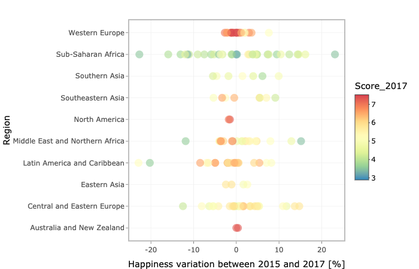
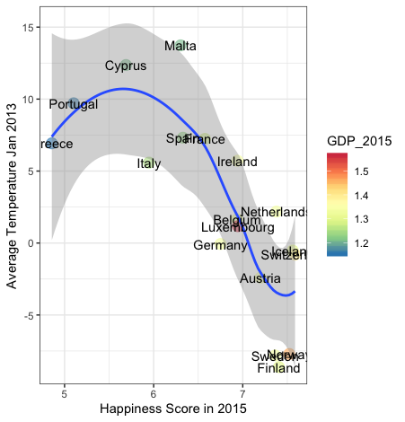

Challenge the “Happiness” Score
================
Chiara
13/10/2017

In this document I will look at the happiness score and try to
understand how much it really reflects the level of “happiness” in a
country.

# Quick Look at Happiness Data

In this section we will take a quick look at the happiness data. In
particular, we will see how to read the data, what the data tells us
about how happiness is spread around the World and how it is changing
over time.

The code below shows the first steps of the data analysis, that do not
produce any graphical output but are necessary to setup the analysis.
The starting point is the Kaggle dataset on [World Happiness
Report](https://www.kaggle.com/unsdsn/world-happiness).

``` r
# setup
knitr::opts_chunk$set(message=FALSE,results='hide', fig.height=3, fig.width=5)
library(ggplot2) # to make pretty plots
library(dplyr) # for inner_join and left_join
library(car) # to recode
library(maps) # for the maps
library(gridExtra) # to arrange the plots in grids
library(plotly) # for interactive plots
library(cowplot) # to have get_legent
#read the datasets and take a look
happy_2015 <- read.csv("../input/world-happiness/2015.csv")
happy_2016 <- read.csv("../input/world-happiness/2016.csv")
happy_2017 <- read.csv("../input/world-happiness/2017.csv")
str(happy_2015)
str(happy_2016)
str(happy_2017)
# Based on the structure, rename columns to prepare for merging
colnames(happy_2015) <- c("Country","Region","Rank_2015","Score_2015","Err_2015","GDP_2015","Family_2015","Health_2015","Freedom_2015","Gov_2015","Generosity_2015","Dist_res_2015")
colnames(happy_2016) <- c("Country","Region_2016","Rank_2016","Score_2016","LCI_2016","UCI_2016","GDP_2016","Family_2016","Health_2016","Freedom_2016","Gov_2016","Generosity_2016","Dist_res_2016")
colnames(happy_2017) <- c("Country","Rank_2017","Score_2017","Whisker.high_2016","Whisker.low_2017","GDP_2017","Family_2017","Health_2017","Freedom_2017","Generosity_2017","Gov_2017","Dist_res_2017")
# And finally merge the datasets into one
happy <- merge(happy_2015, happy_2016, by.x = "Country", by.y = "Country")
happy <- merge(happy, happy_2017, by.x = "Country", by.y = "Country")
happy$Region_2016 <- NULL
str(happy) # when running for the first time, check the structure of the merged dataset
# rename some countries 
happy$Country <- recode(happy$Country, 
                           "'Congo (Brazzaville)' = 'Democratic Republic of the Congo';
                            'Congo (Kinshasa)'='Republic of Congo';
                            'United States'='USA';
                             'United Kingdom'= 'UK'
                           ")
```

## Happiness Score Around the World

Plot of the happiness score in the World in 2017

``` r
w <- map_data("world")
colnames(w)[5]<- "Country"
myw <- inner_join(w, happy, by = "Country")
worldplot <- ggplot(data = w, mapping = aes(x = long, y = lat, group = group)) + 
    coord_fixed(1.3) + 
    geom_polygon(color = "black", fill = "gray") +
    geom_polygon(data=myw, aes(x = long, y = lat, group = group, fill = Score_2017),color = "white") +
    geom_polygon(color = "black", fill = NA) +
    theme_bw() +
    ggtitle("Happiness Score in 2017 in the World") +
    scale_fill_distiller(palette = "Spectral")
worldplot
```

<!-- -->

## Variations in Happiness Score

Compute the variation in percentage between 2017 and
2015.

``` r
happy$var_2016_2015 = 100*(happy$Score_2016 - happy$Score_2015)/happy$Score_2015
happy$var_2017_2016 = 100*(happy$Score_2017 - happy$Score_2016)/happy$Score_2016
happy$var_2017_2015 = 100*(happy$Score_2017 - happy$Score_2015)/happy$Score_2015
```

Is there a correlation between the fact that the happiness score changes
and the value of the happiness score
itself?

<!-- -->

We can see that, in general, the regions that have high happiness score
tend to be more stable, while the ones with the highest variations tend
to also have a low score

# Are “Happy” People Really Happy?

In this section, we look into the correlation between the happiness
score and behavioral indicators that are generally associated to
happiness. In order to do this, we will use the Kaggle dataset [65 World
Indexes](https://www.kaggle.com/joniarroba/65-world-indexes-gathered).

``` r
kaggle <- read.csv("../input/65-world-indexes-gathered/Kaggle.csv")
str(kaggle)
colnames(kaggle)[1] <- "Country"
merged <- merge(happy, kaggle, by.x = "Country", by.y = "Country")
str(merged)
```

## Homicide Rate

We would think that happy people would tend to cause less harm to other
people. The homicide rate is a good indicators of
this.

``` r
ggplot(data=merged, aes(y=Homicide.rate.per.100k.people.2008.2012, x=Score_2015))+
  theme_bw() +
  geom_point(aes(color=Region), size=3, alpha=0.6)   +
  geom_smooth() +
  ylab("Homicide Rate per 100k people 2008-2012")+
  xlab("Happiness Score in 2015")
```

<!-- -->

The homicide rate is pretty flat as a function of the happiness score,
and seems to have more a dependence on the geographical region.

## Suicide Rate

When we look at the suicide rate, this is not flat as a function of the
happiness score, and the trends are different for the male suicide rate
and the female
one.

``` r
srf <- ggplot(data=merged, aes(y=Female.Suicide.Rate.100k.people, x=Score_2015))+
  theme_bw() +
  geom_point(aes(color=Region), size=3, alpha=0.6) + geom_smooth()+
  ylab("Female Suicide Rate per 100k people")+
  xlab("Happiness Score in 2015")

srm <- ggplot(data=merged, aes(y=MaleSuicide.Rate.100k.people, x=Score_2015))+
  theme_bw() +
  geom_point(aes(color=Region), size=3, alpha=0.6) +
  geom_smooth() +
  ylab("Male Suicide Rate per 100k people")+
  xlab("Happiness Score in 2015")
  
grid.arrange(srf+theme(legend.position = "none"), srm+theme(legend.position = "none"), get_legend(srm), ncol = 3)
```

<!-- -->

The trends seem to be different from region to region. Therefore, in the
next section we will look at one specific example: Western Europe.

## Suicide Rate in Western Europe

Since the suicide rate as a function of happiness score seems to have
different behaviors in different geographic region, in this section we
focus on Western Europe.

``` r
europe<-merged[ merged$Region=="Western Europe", ]

srfe <- ggplot(data=europe, aes(y=Female.Suicide.Rate.100k.people, x=Score_2015))+
    theme_bw() +
    geom_smooth()+
    scale_color_distiller(palette = "Spectral")+
    geom_text(aes(label=Country)) +
    xlab("Happiness Score in 2015") +
    geom_point(aes(color=GDP_2015), size=4, alpha=0.6) + 
    ylab("Female Suicide Rate per 100k people")
 
srme <-ggplot(data=europe, aes(y=MaleSuicide.Rate.100k.people, x=Score_2015))+
    theme_bw() +
    geom_smooth()+
    scale_color_distiller(palette = "Spectral")+
    geom_text(aes(label=Country)) +
    xlab("Happiness Score in 2015") +
    geom_point(aes(color=GDP_2015), size=4, alpha=0.6) + 
    ylab("Male Suicide Rate per 100k people")
    
grid.arrange(srfe+theme(legend.position="none"), srme+theme(legend.position="none"), get_legend(srme), ncol = 3,widths=c(3,3,1))
```

<!-- -->

From these plots we can notice that, in Western Europe, the suicide rate
has a correlation with the happiness score opposite than what we would
expect: **the higher the happines score, the higher the suicide rate**.
This is the case for both male suicide rate and female suicide rate:
these two distributions have different normalization (the male suicide
rate is higher than the female suicide rate) but very similar shape in
the dependence from the happiness score.

To understand this result, we need some additional information on other
differences between the countries considered. One option is to look at
the temperature in those countries. To have an indication of the
temperature, we will look at the average temperature in January 2013
(the most recent year available in the weather dataset). This means
that, in our plot, the happiness rate and the temperature will
correspond to two different years (2015 and 2013 respectively). Given
the short time distance, it is safe to assume that the average January
2013 temperature is a good guess also for the average 2015 temperature.
To have data about the temperature, we will use the Kaggle [Climate
Change: Earth Surface Temperature
Data](https://www.kaggle.com/berkeleyearth/climate-change-earth-surface-temperature-data)
dataset.

``` r
weather_all <- read.csv("../input/climate-change-earth-surface-temperature-data/GlobalLandTemperaturesByCountry.csv")
str(weather_all)
weather_2013_01 <- weather_all[weather_all$dt=="2013-01-01",]
weather_2013_01[weather_2013_01$Country=="Denmark",]<-weather_2013_01[weather_2013_01$Country=="Denmark (Europe)",]
str(weather_2013_01)
merged <- merge(merged, weather_2013_01, by.x = "Country", by.y = "Country")
str(merged)
```

First of all, let’s look at the dependence of the happiness score on the
average January temperature

``` r
europe<-merged[ merged$Region=="Western Europe", ]
happy_temp  <- ggplot(data=europe, aes(y=AverageTemperature, x=Score_2015))+
  theme_bw() +
  geom_point(aes(color=GDP_2015), size=4, alpha=0.6) +
  geom_smooth() +
  scale_color_distiller(palette = "Spectral")+
  geom_text(aes(label=Country)) +
  ylab("Average Temperature Jan 2013")+
  xlab("Happiness Score in 2015")
happy_temp  
```

<!-- -->

The happiness score is higher in “cold countries”. But, if we look at
the dependence of the suicide rate from the January temperature, this is
what we
obtain:

``` r
pm <- ggplot(data=europe, aes(y=MaleSuicide.Rate.100k.people, x=AverageTemperature))+
  geom_point(aes(color=Score_2015), size=4, alpha=0.6) +
  theme_bw() +
  geom_smooth() +
  geom_text(aes(label=Country)) +
  scale_color_distiller(palette = "Spectral")+
  ylab("Male Suicide Rate per 100k people")+
  xlab("Average Temperature Jan 2013")

pf <- ggplot(data=europe, aes(y=Female.Suicide.Rate.100k.people, x=AverageTemperature))+
  geom_point(aes(color=Score_2015), size=4, alpha=0.6) +
  theme_bw() +
  geom_smooth() + 
  geom_text(aes(label=Country)) +
  scale_color_distiller(palette = "Spectral")+
  ylab("Female Suicide Rate per 100k people")+
  xlab("Average Temperature Jan 2013")

grid.arrange(pf+  theme(legend.position = "none"), pm+  theme(legend.position = "none"), get_legend(pf), ncol = 3, widths=c(3,3,1))
```


We can see how, despite being the ones with the highest happiness score,
colder countries are also the ones with the highest suicide rate.

# Conclusion

The happiness score provided, seems to be an indicator of
socio-economical satisfaction rather than absolute “happiness” in the
common sense of the word. This is highlighted by the fact that countries
with a high happiness score don’t correspond, for example, to the
countries with the lowest suicide rate. Taking as example the countries
in Western Europe, there is actually an anti-correlation between
happiness score and suicide rate. This is likely not related to the
happiness score itself, but to other factors that affect both
socio-economical and behavioral indicators. An example of these factors
is the temperature: in cold Western-Europe countries, we have both an
higher happiness score but also an higher suicide rate.

This is clearly not claiming that low temperature is the cause of the
higher suicide rate in some Western Europe countries rather than in
other. But it is indicating that factors different than the ones
considered in the happiness score might need to be taken into account to
provide a happiness rank that is closer to the typical notion of
happiness.
